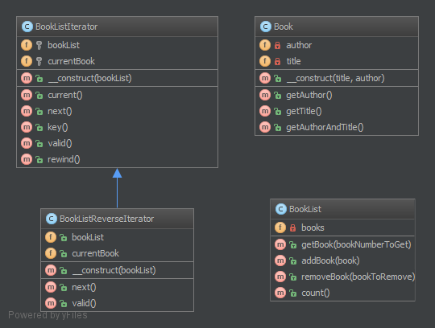

`Iterator`__
bộ lặp
============

Purpose
-------

To make an object iterable and to make it appear like a collection of objects.
_
Để tạo một obj có thể lặp lại và làm cho nó xuất hiện như một bộ sưu tập obj.

Examples
--------

-  to process a file line by line by just running over all lines (which have an object representation) for a file (which of course is an object, too)
_
để xử lý một dòng file bằng dòng chỉ bằng cách chạy trên tất cả các dòng (trong đó có một đại diện obj) cho một file (mà tất nhiên là một obj, quá)

Note
----

Standard PHP Library (SPL) defines an interface Iterator which is best suited for this! Often you would want to implement the Countable interface too, to allow ``count($object)`` on your iterable object
_ Thư viện PHP chuẩn (SPL) định nghĩa một Iterator interface phù hợp nhất cho việc này! Thường thì bạn cũng muốn thực hiện interface đếm được, để cho phép ``count($ object)`` trên obj có thể lặp của bạn

UML Diagram
-----------

Code
----

You can also find this code on `GitHub`_

Book.php

.. literalinclude:: Book.php
   :language: php
   :linenos:

BookList.php

.. literalinclude:: BookList.php
   :language: php
   :linenos:

Test
----

Tests/IteratorTest.php

.. literalinclude:: Tests/IteratorTest.php
   :language: php
   :linenos:

.. _`GitHub`: https://github.com/domnikl/DesignPatternsPHP/tree/master/Behavioral/Iterator
.. __: http://en.wikipedia.org/wiki/Iterator_pattern
