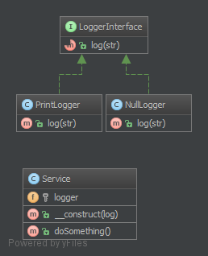

`Null Object`__
Đối tượng null
===============

Purpose
-------

NullObject is not a GoF design pattern but a schema which appears frequently enough to be considered a pattern. It has the following benefits:
-  Client code is simplified
-  Reduces the chance of null pointer exceptions
-  Fewer conditionals require less test cases

Methods that return an object or null should instead return an object or ``NullObject``. ``NullObject``\ s simplify boilerplate code such as ``if (!is_null($obj)) { $obj->callSomething(); }`` to just ``$obj->callSomething();`` by eliminating the conditional check in client code.
_
NullObject không phải là một mẫu thiết kế GoF nhưng một lược đồ xuất hiện thường xuyên đủ để được coi là một mẫu. Nó có những lợi ích sau:
- Client code được đơn giản hóa
- Giảm cơ hội ngoại lệ con trỏ null
- Ít điều kiện hơn yêu cầu ít trường hợp kiểm tra hơn

Các phương thức trả về một obj hoặc null thay vì trả về một obj hoặc ``NullObject``. ``NullObject`` \ s đơn giản hóa mã soạn sẵn như
``if (! Is_null ($ obj)) {$ obj-> callSomething (); }``
để chỉ
``$ obj-> callSomething ();``
bằng cách loại bỏ kiểm tra có điều kiện trong client code.

Examples
--------

-  Symfony2: null logger of profiler
-  Symfony2: null output in Symfony/Console
-  null handler in a Chain of Responsibilities pattern
-  null command in a Command pattern

UML Diagram
-----------

Code
----

You can also find this code on `GitHub`_

Service.php

.. literalinclude:: Service.php
   :language: php
   :linenos:

LoggerInterface.php

.. literalinclude:: LoggerInterface.php
   :language: php
   :linenos:

PrintLogger.php

.. literalinclude:: PrintLogger.php
   :language: php
   :linenos:

NullLogger.php

.. literalinclude:: NullLogger.php
   :language: php
   :linenos:

Test
----

Tests/LoggerTest.php

.. literalinclude:: Tests/LoggerTest.php
   :language: php
   :linenos:

.. _`GitHub`: https://github.com/domnikl/DesignPatternsPHP/tree/master/Behavioral/NullObject
.. __: http://en.wikipedia.org/wiki/Null_Object_pattern