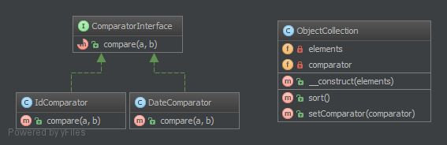

`Strategy`__
Chiến lược
============

Terminology:
------------

-  Context
-  Strategy
-  Concrete Strategy

Purpose
-------

To separate strategies and to enable fast switching between them. Also this pattern is a good alternative to inheritance (instead of having an abstract class that is extended).
_
Để tách các chiến lược và cho phép chuyển đổi nhanh giữa chúng. Ngoài ra mô hình này là một lựa chọn tốt để thừa kế (thay vì có một abstract class được mở rộng).

Examples
--------

-  sorting a list of objects, one strategy by date, the other by id
-  simplify unit testing: e.g. switching between file and in-memory storage
_
- sắp xếp danh sách các obj, một chiến lược theo ngày, cái khác theo id
- đơn giản hóa việc unit testing: ví dụ: chuyển đổi giữa tệp và lưu trữ trong bộ nhớ

--
A Strategy defines a set of algorithms that can be used interchangeably.
Modes of transportation to an airport is an example of a Strategy.
Several options exist such as driving one's own car, taking a taxi, an airport shuttle, a city bus, or a limousine service.
For some airports, subways and helicopters are also available as a mode of transportation to the airport.
Any of these modes of transportation will get a traveler to the airport, and they can be used interchangeably.
The traveler must chose the Strategy based on trade-offs between cost, convenience, and time.
_
Strategy định nghĩa một tập hợp các thuật toán có thể được sử dụng thay thế cho nhau.
Các phương thức vận chuyển đến sân bay là một ví dụ về Strategy.
Một số tùy chọn tồn tại như lái xe của riêng mình, đi taxi, xe đưa đón sân bay, xe buýt thành phố hoặc dịch vụ xe limousine.
Đối với một số sân bay, tàu điện ngầm và máy bay trực thăng cũng có sẵn như một phương thức vận chuyển đến sân bay.
Bất kỳ phương thức vận tải nào trong số này đều sẽ đưa du khách đến sân bay và chúng có thể được sử dụng thay thế cho nhau.
Du khách phải chọn Strategy dựa trên sự cân bằng giữa chi phí, tiện lợi và thời gian.

UML Diagram
-----------

Code
----

You can also find this code on `GitHub`_

Context.php

.. literalinclude:: Context.php
   :language: php
   :linenos:

ComparatorInterface.php

.. literalinclude:: ComparatorInterface.php
   :language: php
   :linenos:

DateComparator.php

.. literalinclude:: DateComparator.php
   :language: php
   :linenos:

IdComparator.php

.. literalinclude:: IdComparator.php
   :language: php
   :linenos:

Test
----

Tests/StrategyTest.php

.. literalinclude:: Tests/StrategyTest.php
   :language: php
   :linenos:

.. _`GitHub`: https://github.com/domnikl/DesignPatternsPHP/tree/master/Behavioral/Strategy
.. __: http://en.wikipedia.org/wiki/Strategy_pattern