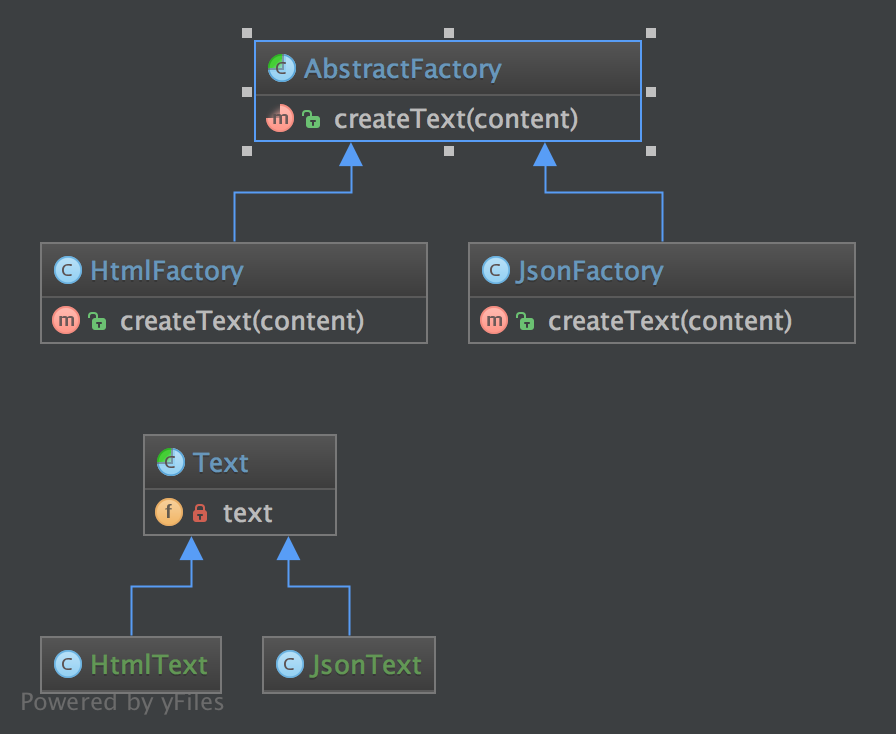

`Abstract Factory`__
Nhà máy trừu tượng
====================

Purpose
-------

To create series of related or dependent objects without specifying their concrete classes. Usually the created classes all implement the same interface. The client of the abstract factory does not care about how these objects are created, he just knows how they go together.
_
Để tạo chuỗi các obj liên quan hoặc phụ thuộc mà không chỉ định các lớp cụ thể của chúng. Thông thường các lớp được tạo ra đều thực hiện cùng một interface. Client của abstract factory không quan tâm đến cách các obj này được tạo ra, anh ta chỉ biết cách chúng đi cùng nhau.

UML Diagram
-----------

Code
----

You can also find this code on `GitHub`_

AbstractFactory.php

.. literalinclude:: AbstractFactory.php
   :language: php
   :linenos:

JsonFactory.php

.. literalinclude:: JsonFactory.php
   :language: php
   :linenos:

HtmlFactory.php

.. literalinclude:: HtmlFactory.php
   :language: php
   :linenos:

Text.php

.. literalinclude:: Text.php
   :language: php
   :linenos:

JsonText.php

.. literalinclude:: JsonText.php
   :language: php
   :linenos:

HtmlText.php

.. literalinclude:: HtmlText.php
   :language: php
   :linenos:

Test
----

Tests/AbstractFactoryTest.php

.. literalinclude:: Tests/AbstractFactoryTest.php
   :language: php
   :linenos:

.. _`GitHub`: https://github.com/domnikl/DesignPatternsPHP/tree/master/Creational/AbstractFactory
.. __: http://en.wikipedia.org/wiki/Abstract_factory_pattern
