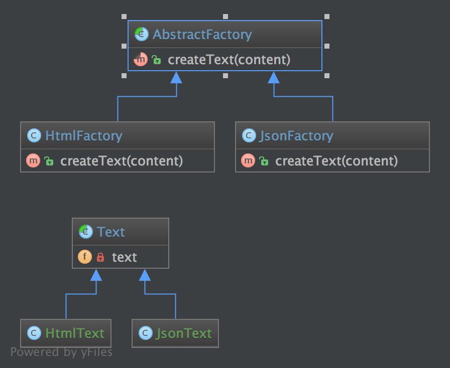

`Abstract Factory`__
Nhà máy trừu tượng
====================

Purpose
-------

To create series of related or dependent objects without specifying their concrete classes. Usually the created classes all implement the same interface. The client of the abstract factory does not care about how these objects are created, he just knows how they go together.
_
Để tạo chuỗi các obj liên quan hoặc phụ thuộc mà không chỉ định các lớp cụ thể của chúng. Thông thường các lớp được tạo ra đều thực hiện cùng một interface. Client của abstract factory không quan tâm đến cách các obj này được tạo ra, anh ta chỉ biết cách chúng đi cùng nhau.

Examples
--------
The purpose of the Abstract Factory is to provide an interface for creating families of related objects, without specifying concrete classes.
This pattern is found in the sheet metal stamping equipment used in the manufacture of Japanese automobiles.
The stamping equipment is an Abstract Factory which creates auto body parts.
The same machinery is used to stamp: right hand doors, left hand doors, right front fenders, left front fenders, hoods, etc. for different models of cars.
Through the use of rollers to change the stamping dies, the concrete classes produced by the machinery can be changed within three minutes.
_
Mục đích của Abstract Factory là cung cấp một giao diện để tạo ra các họ của các đối tượng liên quan, mà không chỉ định các lớp cụ thể.
Mẫu này được tìm thấy trong các thiết bị dập kim loại tấm được sử dụng trong sản xuất ô tô Nhật Bản.
Thiết bị dập là một Nhà máy Tóm tắt mà tạo phụ tùng ô tô cơ thể.
Các máy móc tương tự được sử dụng để đóng dấu: cánh tay phải, cửa tay trái, chắn bùn phía trước bên phải, chắn bùn phía trước bên trái, mũ trùm, vv cho các mô hình khác nhau của xe ô tô.
Thông qua việc sử dụng con lăn để thay đổi khuôn dập, các lớp bê tông do máy móc sản xuất có thể được thay đổi trong vòng ba phút.

UML Diagram
-----------

Code
----

You can also find this code on `GitHub`_

AbstractFactory.php

.. literalinclude:: AbstractFactory.php
   :language: php
   :linenos:

JsonFactory.php

.. literalinclude:: JsonFactory.php
   :language: php
   :linenos:

HtmlFactory.php

.. literalinclude:: HtmlFactory.php
   :language: php
   :linenos:

Text.php

.. literalinclude:: Text.php
   :language: php
   :linenos:

JsonText.php

.. literalinclude:: JsonText.php
   :language: php
   :linenos:

HtmlText.php

.. literalinclude:: HtmlText.php
   :language: php
   :linenos:

Test
----

Tests/AbstractFactoryTest.php

.. literalinclude:: Tests/AbstractFactoryTest.php
   :language: php
   :linenos:

.. _`GitHub`: https://github.com/domnikl/DesignPatternsPHP/tree/master/Creational/AbstractFactory
.. __: http://en.wikipedia.org/wiki/Abstract_factory_pattern
