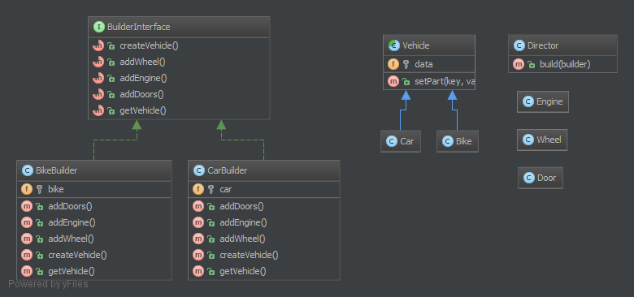

`Builder`__
Thợ xây
===========

Purpose
-------

Builder is an interface that build parts of a complex object.
Sometimes, if the builder has a better knowledge of what it builds, this interface could be an abstract class with default methods (aka adapter).
If you have a complex inheritance tree for objects, it is logical to have a complex inheritance tree for builders too.
Note: Builders have often a fluent interface, see the mock builder of PHPUnit for example.
_
Builder là một interface xây dựng các phần của một obj phức tạp.
Đôi khi, nếu builder có kiến thức tốt hơn về những gì nó xây dựng, interface này có thể là một abstract class với các methods mặc định (còn gọi là adapter).
Nếu bạn có một cây thừa kế phức tạp cho các obj, nó là hợp lý để có một cây thừa kế phức tạp cho builders.
Lưu ý: Builders thường có interface thông thạo, xem ví dụ về trình xây dựng giả lập của PHPUnit.

Examples
--------

-  PHPUnit: Mock Builder

--
The Builder pattern separates the construction of a complex object from its representation so that the same construction process can create different representations. This pattern is used by fast food restaurants to construct children's meals.
Children's meals typically consist of a main item, a side item, a drink, and a toy (e.g., a hamburger, fries, Coke, and toy dinosaur).
Note that there can be variation in the content of the children's meal, but the construction process is the same.
Whether a customer orders a hamburger, cheeseburger, or chicken, the process is the same.
The employee at the counter directs the crew to assemble a main item, side item, and toy.
These items are then placed in a bag.
The drink is placed in a cup and remains outside of the bag.
This same process is used at competing restaurants.
_
Mẫu Builder tách riêng việc xây dựng một đối tượng phức tạp khỏi biểu diễn của nó sao cho cùng một quá trình xây dựng có thể tạo ra các biểu diễn khác nhau. Mô hình này được sử dụng bởi các nhà hàng thức ăn nhanh để xây dựng bữa ăn cho trẻ em.
Bữa ăn của trẻ em thường bao gồm một món chính, đồ phụ, đồ uống và đồ chơi (ví dụ: bánh hamburger, khoai tây chiên, Coke và đồ chơi khủng long).
Lưu ý rằng có thể có sự thay đổi trong nội dung của bữa ăn của trẻ em, nhưng quá trình xây dựng là như nhau.
Cho dù khách hàng yêu cầu một chiếc bánh hamburger, cheeseburger, hoặc gà, quá trình này là như nhau.
Các nhân viên tại quầy chỉ đạo các phi hành đoàn để lắp ráp một mặt hàng chính, mặt hàng, và đồ chơi.
Những đồ vật này sau đó được đặt trong túi.
Đồ uống được đặt trong một cái cốc và vẫn ở bên ngoài túi.
Quá trình tương tự này được sử dụng tại các nhà hàng cạnh tranh.

UML Diagram
-----------

Code
----

You can also find this code on `GitHub`_

Director.php

.. literalinclude:: Director.php
   :language: php
   :linenos:

BuilderInterface.php

.. literalinclude:: BuilderInterface.php
   :language: php
   :linenos:

TruckBuilder.php

.. literalinclude:: TruckBuilder.php
   :language: php
   :linenos:

CarBuilder.php

.. literalinclude:: CarBuilder.php
   :language: php
   :linenos:

Parts/Vehicle.php

.. literalinclude:: Parts/Vehicle.php
   :language: php
   :linenos:

Parts/Truck.php

.. literalinclude:: Parts/Truck.php
   :language: php
   :linenos:

Parts/Car.php

.. literalinclude:: Parts/Car.php
   :language: php
   :linenos:

Parts/Engine.php

.. literalinclude:: Parts/Engine.php
   :language: php
   :linenos:

Parts/Wheel.php

.. literalinclude:: Parts/Wheel.php
   :language: php
   :linenos:

Parts/Door.php

.. literalinclude:: Parts/Door.php
   :language: php
   :linenos:

Test
----

Tests/DirectorTest.php

.. literalinclude:: Tests/DirectorTest.php
   :language: php
   :linenos:

.. _`GitHub`: https://github.com/domnikl/DesignPatternsPHP/tree/master/Creational/Builder
.. __: http://en.wikipedia.org/wiki/Builder_pattern
