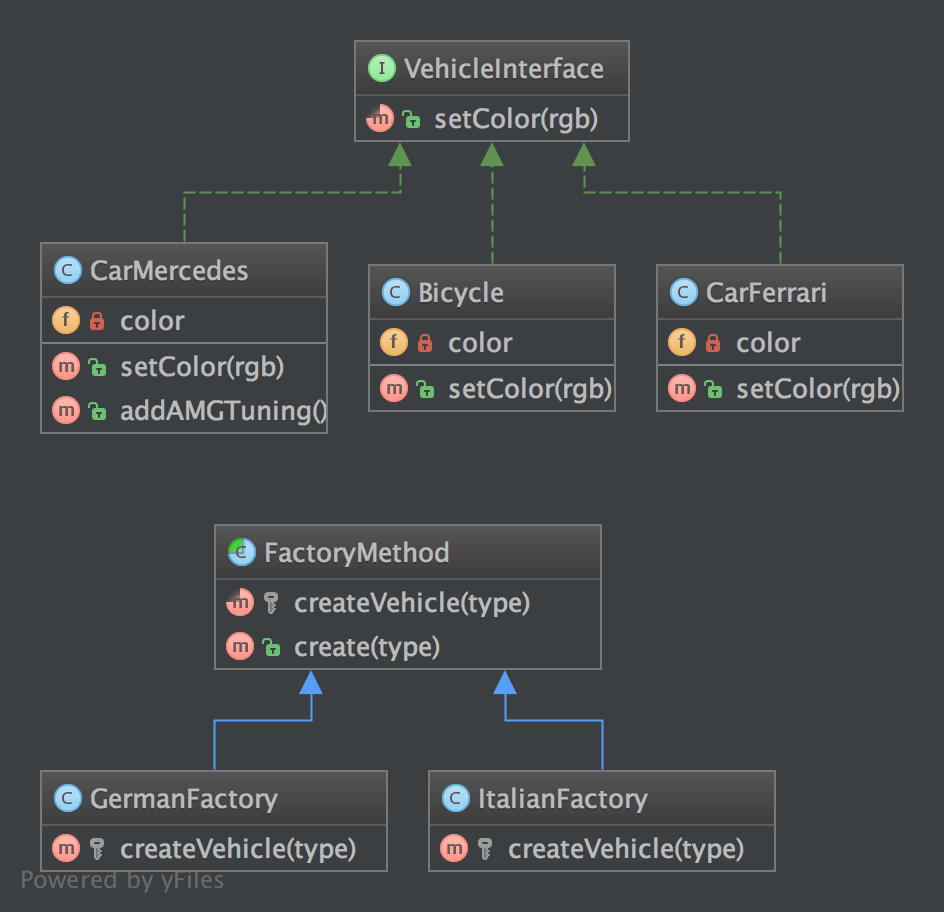

`Factory Method`__
phương thức nhà máy
==================

Purpose
-------

The good point over the SimpleFactory is you can subclass it to implement different ways to create objects
For simple case, this abstract class could be just an interface
This pattern is a "real" Design Pattern because it achieves the "Dependency Inversion Principle" aka the "D" in S.O.L.I.D principles.
It means the FactoryMethod class depends on abstractions, not concrete classes. This is the real trick compared to SimpleFactory or StaticFactory.
_
Điểm tốt trên SimpleFactory là bạn có thể phân lớp nó để thực hiện các cách khác nhau để tạo ra các obj
Đối với trường hợp đơn giản, lớp trừu tượng này có thể chỉ là một interface
Mẫu này là DP "real" bởi vì nó đạt được "Dependency Inversion Principle" gọi là "D" trong nguyên tắc S.O.L.I.D.
Nó có nghĩa là lớp FactoryMethod phụ thuộc vào trừu tượng hóa, không phụ thuộc vào các lớp cụ thể. Đây là thủ thuật thực sự so với SimpleFactory hoặc StaticFactory.

UML Diagram
-----------

Code
----

You can also find this code on `GitHub`_

FactoryMethod.php

.. literalinclude:: FactoryMethod.php
   :language: php
   :linenos:

ItalianFactory.php

.. literalinclude:: ItalianFactory.php
   :language: php
   :linenos:

GermanFactory.php

.. literalinclude:: GermanFactory.php
   :language: php
   :linenos:

VehicleInterface.php

.. literalinclude:: VehicleInterface.php
   :language: php
   :linenos:

CarMercedes.php

.. literalinclude:: CarMercedes.php
   :language: php
   :linenos:

CarFerrari.php

.. literalinclude:: CarFerrari.php
   :language: php
   :linenos:

Bicycle.php

.. literalinclude:: Bicycle.php
   :language: php
   :linenos:

Test
----

Tests/FactoryMethodTest.php

.. literalinclude:: Tests/FactoryMethodTest.php
   :language: php
   :linenos:

.. _`GitHub`: https://github.com/domnikl/DesignPatternsPHP/tree/master/Creational/FactoryMethod
.. __: http://en.wikipedia.org/wiki/Factory_method_pattern
