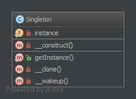

`Singleton`__
đơn nhất
=============

**THIS IS CONSIDERED TO BE AN ANTI-PATTERN! FOR BETTER TESTABILITY AND MAINTAINABILITY USE DEPENDENCY INJECTION!**

Purpose
-------

To have only one instance of this object in the application that will handle all calls.
_
Để chỉ có một cá thể của obj này trong ứng dụng mà sẽ xử lý tất cả các cuộc gọi.

Examples
--------

-  DB Connector
-  Logger (may also be a Multiton if there are many log files for several purposes)
-  Lock file for the application (there is only one in the filesystem ...)
_
- Trình kết nối DB
- Logger (cũng có thể là một Multiton nếu có nhiều log files cho nhiều mục đích)
- Lock file cho ứng dụng (chỉ có một tệp trong hệ thống tệp ...)

--
The Singleton pattern ensures that a class has only one instance and provides a global point of access to that instance.
It is named after the singleton set, which is defined to be a set containing one element.
The office of the President of the United States is a Singleton.
The United States Constitution specifies the means by which a president is elected, limits the term of office, and defines the order of succession.
As a result, there can be at most one active president at any given time.
Regardless of the personal identity of the active president, the title, "The President of the United States" is a global point of access that identifies the person in the office.
_
Mẫu Singleton đảm bảo rằng một lớp chỉ có một cá thể và cung cấp một điểm truy cập toàn cục cho cá thể đó.
Nó được đặt tên theo tập singleton, được định nghĩa là một tập hợp chứa một phần tử.
Văn phòng của Tổng thống Hoa Kỳ là một Singleton.
Hiến pháp Hoa Kỳ quy định cụ thể các phương tiện mà một tổng thống được bầu, giới hạn nhiệm kỳ của văn phòng và xác định thứ tự liên tiếp.
Kết quả là, có thể có tối đa một chủ tịch hoạt động tại bất kỳ thời điểm nào.
Bất kể danh tính cá nhân của chủ tịch hoạt động, danh hiệu, "Tổng thống Hoa Kỳ" là một điểm truy cập toàn cầu xác định người trong văn phòng.

UML Diagram
-----------

Code
----

You can also find this code on `GitHub`_

Singleton.php

.. literalinclude:: Singleton.php
   :language: php
   :linenos:

Test
----

Tests/SingletonTest.php

.. literalinclude:: Tests/SingletonTest.php
   :language: php
   :linenos:

.. _`GitHub`: https://github.com/domnikl/DesignPatternsPHP/tree/master/Creational/Singleton
.. __: http://en.wikipedia.org/wiki/Singleton_pattern
