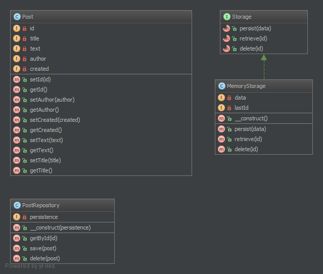

`Repository`__
Kho
==========

Purpose
-------

Mediates between the domain and data mapping layers using a collection-like interface for accessing domain objects. Repository encapsulates the set of objects persisted in a data store and the operations performed over them, providing a more object-oriented view of the persistence layer. Repository also supports the objective of achieving a clean separation and one-way dependency between the domain and data mapping layers.
_
Làm trung gian giữa các tên miền và lớp ánh xạ dữ liệu dùng một interface collection-like để truy cập vào các obj miền. Repository đóng gói tập hợp các obj tồn tại trong một kho dữ liệu và các hoạt động được thực hiện trên chúng, cung cấp một cái nhìn hướng obj hơn của lớp tồn tại. Repository cũng hỗ trợ mục tiêu đạt được sự tách biệt rõ ràng và phụ thuộc một chiều giữa các data mapping layers và domain.

Examples
--------

-  Doctrine 2 ORM: there is Repository that mediates between Entity and DBAL and contains methods to retrieve objects
-  Laravel Framework
_
- Doctrine 2 ORM: có Repository trung gian giữa Entity và DBAL và chứa các phương thức để lấy các obj
- Laravel Framework

UML Diagram
-----------

Code
----

You can also find this code on `GitHub`_

Post.php

.. literalinclude:: Post.php
   :language: php
   :linenos:

PostRepository.php

.. literalinclude:: PostRepository.php
   :language: php
   :linenos:

MemoryStorage.php

.. literalinclude:: MemoryStorage.php
   :language: php
   :linenos:

Test
----

Tests/RepositoryTest.php

.. literalinclude:: Tests/RepositoryTest.php
    :language: php
    :linenos:

.. _`GitHub`: https://github.com/domnikl/DesignPatternsPHP/tree/master/More/Repository
