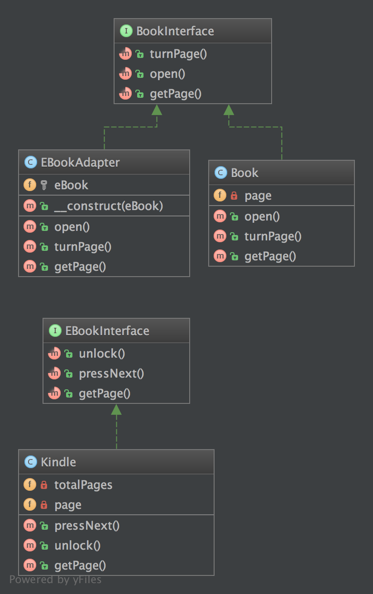

`Adapter / Wrapper`__
Bộ chuyển đổi / Vỏ bọc
=====================

Purpose
-------

To translate one interface for a class into a compatible interface. An adapter allows classes to work together that normally could not because of incompatible interfaces by providing its interface to clients while using the original interface.
_
Để dịch (chuyển) một interface cho một lớp thành một interface tương thích. Một adapter cho phép các lớp làm việc cùng nhau mà thông thường thì không thể, vì các interface không tương thích, bằng cách cung cấp interface của nó cho các client trong khi dùng interface gốc.

Examples
--------

-  DB Client libraries adapter
-  using multiple different webservices and adapters normalize data so that the outcome is the same for all
_
- Bộ chuyển đổi thư viện Client DB
- Dùng nhiều webservices và adapters khác nhau để chuẩn hóa dữ liệu để kết quả giống nhau cho tất cả

--
The Adapter pattern allows otherwise incompatible classes to work together by converting the interface of one class into an interface expected by the clients.
Socket wrenches provide an example of the Adapter.
A socket attaches to a ratchet, provided that the size of the drive is the same.
Typical drive sizes in the United States are 1/2" and 1/4".
Obviously, a 1/2" drive ratchet will not fit into a 1/4" drive socket unless an adapter is used.
A 1/2" to 1/4" adapter has a 1/2" female connection to fit on the 1/2" drive ratchet, and a 1/4" male connection to fit in the 1/4" drive socket.
_
Mẫu Adapter cho phép các lớp không tương thích khác hoạt động cùng nhau bằng cách chuyển đổi giao diện của một lớp thành giao diện mà khách hàng mong đợi.
Socket wrenches cung cấp một ví dụ về Adapter.
Một ổ cắm gắn vào một ratchet, với điều kiện kích thước của ổ đĩa là như nhau. Kích thước ổ đĩa điển hình ở Hoa Kỳ là 1/2 "và 1/4".
Rõ ràng, một ratchet 1/2 "ổ đĩa sẽ không phù hợp với một ổ cắm ổ đĩa 1/4" trừ khi một bộ chuyển đổi được sử dụng.
Một bộ chuyển đổi 1/2 "đến 1/4" có một kết nối nữ 1/2 "để phù hợp trên 1/2" ratchet ổ đĩa, và một 1/4 "kết nối nam để phù hợp trong ổ cắm ổ đĩa 1/4".

UML Diagram
-----------

Code
----

You can also find this code on `GitHub`_

BookInterface.php

.. literalinclude:: BookInterface.php
   :language: php
   :linenos:

Book.php

.. literalinclude:: Book.php
   :language: php
   :linenos:

EBookAdapter.php

.. literalinclude:: EBookAdapter.php
   :language: php
   :linenos:

EBookInterface.php

.. literalinclude:: EBookInterface.php
   :language: php
   :linenos:

Kindle.php

.. literalinclude:: Kindle.php
   :language: php
   :linenos:

Test
----

Tests/AdapterTest.php

.. literalinclude:: Tests/AdapterTest.php
   :language: php
   :linenos:

.. _`GitHub`: https://github.com/domnikl/DesignPatternsPHP/tree/master/Structural/Adapter
.. __: http://en.wikipedia.org/wiki/Adapter_pattern
