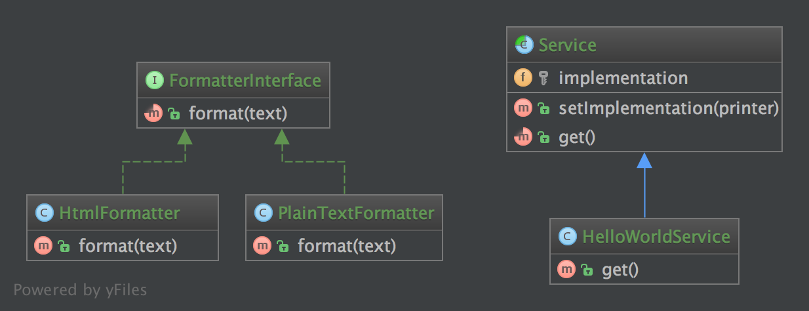

`Bridge`__
Cầu nối
==========

Purpose
-------

Decouple an abstraction from its implementation so that the two can vary independently.
_
Tách một sự trừu tượng từ việc thực hiện nên hai cái có thể khác nhau một cách độc lập.

Examples
--------

-  `Symfony
   DoctrineBridge <https://github.com/symfony/DoctrineBridge>`__

--
The Client doesn't want to deal with platform-dependent details. The Bridge pattern encapsulates this complexity behind an abstraction "wrapper".
Bridge emphasizes identifying and decoupling "interface" abstraction from "implementation" abstraction.
_
Khách hàng không muốn xử lý các chi tiết phụ thuộc vào nền tảng. Các mô hình cầu đóng gói phức tạp này đằng sau một wrapper "trừu tượng".
Bridge nhấn mạnh việc xác định và tách rời giao diện "trừu tượng" khỏi sự trừu tượng "triển khai".

UML Diagram
-----------

Code
----

You can also find this code on `GitHub`_

FormatterInterface.php

.. literalinclude:: FormatterInterface.php
   :language: php
   :linenos:

PlainTextFormatter.php

.. literalinclude:: PlainTextFormatter.php
   :language: php
   :linenos:

HtmlFormatter.php

.. literalinclude:: HtmlFormatter.php
   :language: php
   :linenos:

Service.php

.. literalinclude:: Service.php
   :language: php
   :linenos:

HelloWorldService.php

.. literalinclude:: HelloWorldService.php
   :language: php
   :linenos:

Test
----

Tests/BridgeTest.php

.. literalinclude:: Tests/BridgeTest.php
   :language: php
   :linenos:

.. _`GitHub`: https://github.com/domnikl/DesignPatternsPHP/tree/master/Structural/Bridge
.. __: http://en.wikipedia.org/wiki/Bridge_pattern
