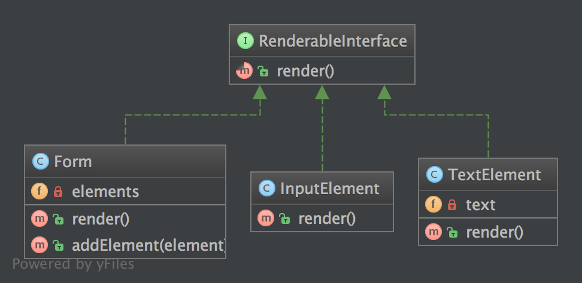

`Composite`__
Hỗn hợp
=============

Purpose
-------

To treat a group of objects the same way as a single instance of the object.
_
Để xử lý một nhóm các obj giống như một cá thể của obj.

Examples
--------

-  a form class instance handles all its form elements like a single instance of the form, when ``render()`` is called, it subsequently runs through all its child elements and calls ``render()`` on them
-  ``Zend_Config``: a tree of configuration options, each one is a ``Zend_Config`` object itself
_
- một thể hiện của lớp biểu mẫu xử lý tất cả các phần tử biểu mẫu của nó giống như một cá thể của biểu mẫu, khi ``render()`` được gọi, sau đó nó chạy qua tất cả các phần tử con của nó và gọi ``render()`` trên chúng
- ``Zend_Config``: một cây các tùy chọn cấu hình, mỗi cái là một obj ``Zend_Config``

UML Diagram
-----------

Code
----

You can also find this code on `GitHub`_

RenderableInterface.php

.. literalinclude:: RenderableInterface.php
   :language: php
   :linenos:

Form.php

.. literalinclude:: Form.php
   :language: php
   :linenos:

InputElement.php

.. literalinclude:: InputElement.php
   :language: php
   :linenos:

TextElement.php

.. literalinclude:: TextElement.php
   :language: php
   :linenos:

Test
----

Tests/CompositeTest.php

.. literalinclude:: Tests/CompositeTest.php
   :language: php
   :linenos:

.. _`GitHub`: https://github.com/domnikl/DesignPatternsPHP/tree/master/Structural/Composite
.. __: http://en.wikipedia.org/wiki/Composite_pattern
