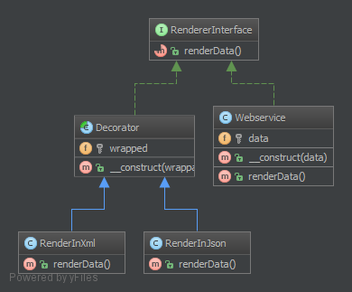

`Decorator`__
Trình trang trí
=============

Purpose
-------

To dynamically add new functionality to class instances.
_
Để tự động thêm chức năng mới vào các cá thể lớp.

Examples
--------

-  Zend Framework: decorators for ``Zend_Form_Element`` instances
-  Web Service Layer: Decorators JSON and XML for a REST service (in this case, only one of these should be allowed of course)
_
- Zend: decorators cho các cá thể ``Zend_Form_Element``
- Web Service Layer: Decorators JSON và XML cho một dịch vụ REST (trong trường hợp này, chỉ một trong những dịch vụ này phải được cho phép)

UML Diagram
-----------

Code
----

You can also find this code on `GitHub`_

RenderableInterface.php

.. literalinclude:: RenderableInterface.php
   :language: php
   :linenos:

Webservice.php

.. literalinclude:: Webservice.php
   :language: php
   :linenos:

RendererDecorator.php

.. literalinclude:: RendererDecorator.php
   :language: php
   :linenos:

XmlRenderer.php

.. literalinclude:: XmlRenderer.php
   :language: php
   :linenos:

JsonRenderer.php

.. literalinclude:: JsonRenderer.php
   :language: php
   :linenos:

Test
----

Tests/DecoratorTest.php

.. literalinclude:: Tests/DecoratorTest.php
   :language: php
   :linenos:

.. _`GitHub`: https://github.com/domnikl/DesignPatternsPHP/tree/master/Structural/Decorator
.. __: http://en.wikipedia.org/wiki/Decorator_pattern
