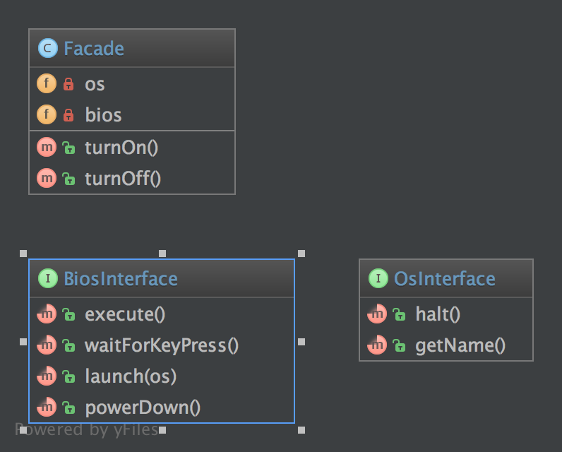

`Facade`__
Mặt tiền
==========

Purpose
-------

The primary goal of a Facade Pattern is not to avoid you to read the manual of a complex API. It's only a side-effect. The first goal is to reduce coupling and follow the Law of Demeter.
A Facade is meant to decouple a client and a sub-system by embedding many (but sometimes just one) interface, and of course to reduce complexity.
-  A facade does not forbid you the access to the sub-system
-  You can (you should) have multiple facades for one sub-system
That's why a good facade has no ``new`` in it. If there are multiple creations for each method, it is not a Facade, it's a Builder or a [Abstract\|Static\|Simple] Factory [Method].
The best facade has no ``new`` and a constructor with interface-type-hinted parameters. If you need creation of new instances, use a Factory as argument.
_
Mục tiêu chính của Facade Pattern không phải là để tránh bạn đọc hướng dẫn dùng API phức tạp. Nó chỉ là một tác dụng phụ. Mục tiêu đầu tiên là giảm khớp nối và tuân theo Luật Demeter.
1 Facade có nghĩa là để tách một client và một hệ thống con bằng cách nhúng nhiều (nhưng đôi khi chỉ là một) interface, và tất nhiên để giảm sự phức tạp.
- Facade không cấm bạn truy cập vào hệ thống con
- Bạn nên có nhiều Facade cho một hệ thống phụ
Đó là lý do tại sao một Facade tốt không có ``new`` trong đó. Nếu có nhiều sáng tạo cho mỗi phương thức, nó không phải là một mặt tiền, nó là một Builder hoặc một [Abstract\Static\Simple] Factory [Method].
Facade tốt nhất không có ``new`` và một hàm tạo với các tham số interface-type-hinted. Nếu bạn cần tạo các cá thể mới, hãy dùng Factory làm đối số.

Examples
--------
The Facade defines a unified, higher level interface to a subsystem that makes it easier to use. Consumers encounter a Facade when ordering from a catalog. The consumer calls one number and speaks with a customer service representative. The customer service representative acts as a Facade, providing an interface to the order fulfillment department, the billing department, and the shipping department.
_
Facade định nghĩa một giao diện cấp cao, thống nhất cho một hệ thống phụ giúp dễ sử dụng hơn. Người tiêu dùng gặp phải một mặt tiền khi đặt hàng từ một cửa hàng. Người tiêu dùng gọi một số và nói chuyện với đại diện dịch vụ khách hàng. Đại diện dịch vụ khách hàng hoạt động như một Mặt tiền, cung cấp một giao diện cho bộ phận thực hiện đơn đặt hàng, phòng thanh toán và bộ phận giao hàng.

UML Diagram
-----------

Code
----

You can also find this code on `GitHub`_

Facade.php

.. literalinclude:: Facade.php
   :language: php
   :linenos:

OsInterface.php

.. literalinclude:: OsInterface.php
   :language: php
   :linenos:

BiosInterface.php

.. literalinclude:: BiosInterface.php
   :language: php
   :linenos:

Test
----

Tests/FacadeTest.php

.. literalinclude:: Tests/FacadeTest.php
   :language: php
   :linenos:

.. _`GitHub`: https://github.com/domnikl/DesignPatternsPHP/tree/master/Structural/Facade
.. __: http://en.wikipedia.org/wiki/Facade_pattern
