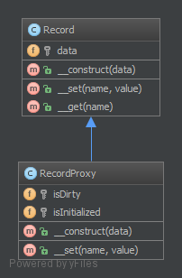

`Proxy`__
Ủy quyền
=========

Purpose
-------

To interface to anything that is expensive or impossible to duplicate.
_
Để giao tiếp với bất kỳ thứ gì tốn kém hoặc không thể sao chép.

Examples
--------

-  Doctrine2 uses proxies to implement framework magic (e.g. lazy initialization) in them, while the user still works with his own entity classes and will never use nor touch the proxies
_
- Doctrine2 dùng proxy để triển khai khung ma thuật (ví dụ: khởi tạo lười) trong khi người dùng vẫn làm việc với các lớp thực thể của riêng mình và sẽ không bao giờ dùng cũng như không chạm vào proxy

--
The Proxy provides a surrogate or place holder to provide access to an object. A check or bank draft is a proxy for funds in an account. A check can be used in place of cash for making purchases and ultimately controls access to cash in the issuer's account.
_
Proxy cung cấp người đại diện hoặc người giữ chỗ để cung cấp quyền truy cập vào một đối tượng. Séc hoặc hối phiếu ngân hàng là ủy quyền cho tiền trong tài khoản. Séc có thể được sử dụng thay cho tiền mặt để mua hàng và cuối cùng kiểm soát quyền truy cập vào tiền mặt trong tài khoản của nhà phát hành.

UML Diagram
-----------

Code
----

You can also find this code on `GitHub`_

Record.php

.. literalinclude:: Record.php
   :language: php
   :linenos:

RecordProxy.php

.. literalinclude:: RecordProxy.php
   :language: php
   :linenos:

Test
----

.. _`GitHub`: https://github.com/domnikl/DesignPatternsPHP/tree/master/Structural/Proxy
.. __: http://en.wikipedia.org/wiki/Proxy_pattern
