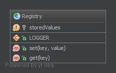

`Registry`__
Đăng ký
============

Purpose
-------

To implement a central storage for objects often used throughout the application, is typically implemented using an abstract class with only static methods (or using the Singleton pattern). Remember that this introduces global state, which should be avoided at all times! Instead implement it using Dependency Injection!
_
Để thực hiện một lưu trữ trung tâm cho các obj thường được dùng trong suốt ứng dụng, thường được thực hiện bằng cách dùng một lớp trừu tượng chỉ với các phương thức tĩnh (hoặc dùng mẫu Singleton). Hãy nhớ rằng điều này giới thiệu trạng thái toàn cầu, nên tránh mọi lúc! Thay vào đó, hãy triển khai nó bằng cách dùng Dependency Injection!

Examples
--------

-  Zend Framework 1: ``Zend_Registry`` holds the application's logger object, front controller etc.
-  Yii Framework: ``CWebApplication`` holds all the application components, such as ``CWebUser``, ``CUrlManager``, etc.
_
- Zend 1: ``Zend_Registry`` giữ obj logger của ứng dụng, front controller, vv
- Yii: ``CWebApplication`` giữ tất cả các thành phần ứng dụng, chẳng hạn như ``CWebUser``, ``CUrlManager``, ..

UML Diagram
-----------

Code
----

You can also find this code on `GitHub`_

Registry.php

.. literalinclude:: Registry.php
   :language: php
   :linenos:

Test
----

Tests/RegistryTest.php

.. literalinclude:: Tests/RegistryTest.php
   :language: php
   :linenos:

.. _`GitHub`: https://github.com/domnikl/DesignPatternsPHP/tree/master/Structural/Registry
.. __: http://en.wikipedia.org/wiki/Service_locator_pattern
